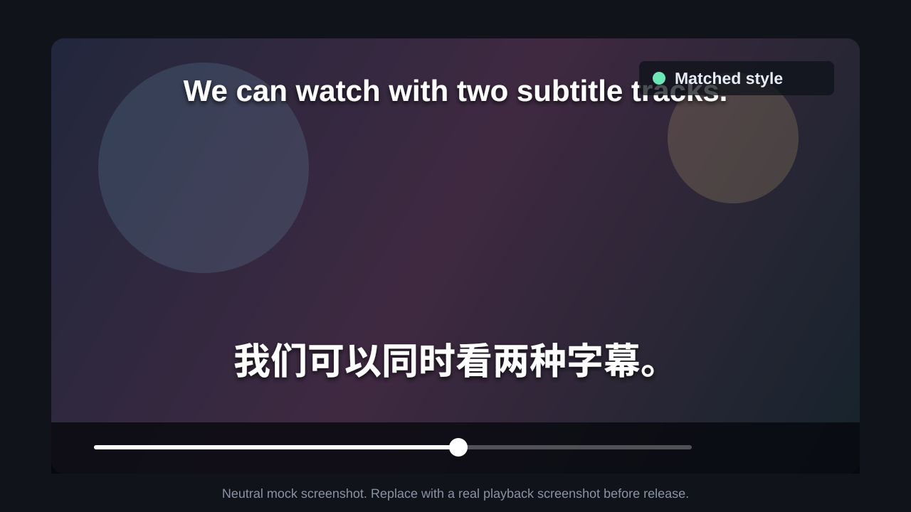
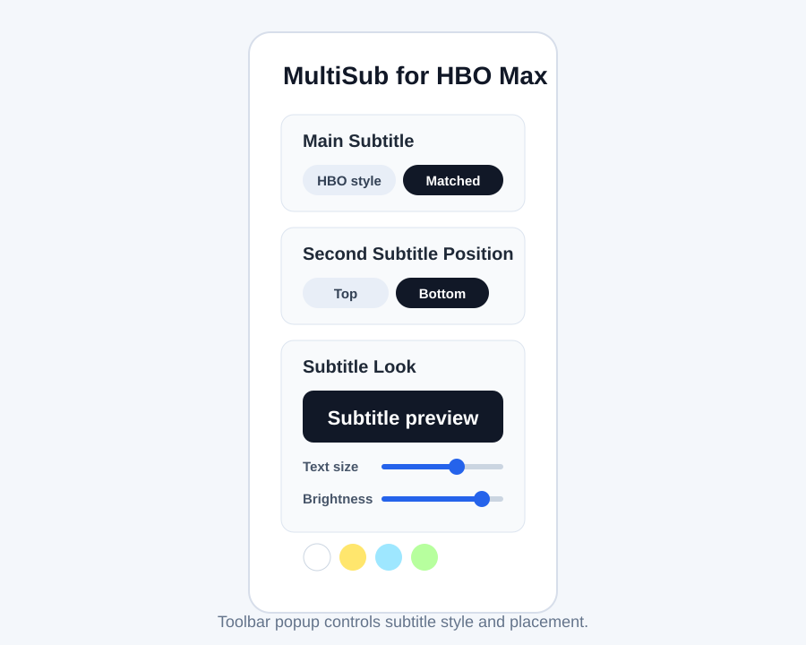

# MultiSub for HBO Max

Free and open-source dual subtitles for HBO Max.

MultiSub for HBO Max adds a second subtitle track to the HBO Max player, using the subtitle languages that are already available for the current title. It is built for people who watch with two languages at once: language learners, bilingual households, and anyone who wants original-language subtitles and another available language track on screen together.

## Features

- Adds a `Secondary Subtitles` section directly inside HBO Max's native subtitles menu.
- Uses official subtitle tracks from the current video manifest.
- Keeps HBO's original subtitle selector working.
- Loads only the selected second subtitle track.
- Supports a matched-style mode where the extension renders both the main and second subtitles for a consistent look.
- Lets the second subtitle appear at the top of the video or below the main subtitle in the lower subtitle area.
- Keeps plugin-rendered main subtitles larger and above the second subtitle when both are shown at the bottom.
- Restores the last selected second subtitle when a video opens.
- Provides a toolbar popup for text size, outline, brightness, position, color, main subtitle mode, and second subtitle placement.
- Includes live debug snapshots for investigating subtitle sync issues.

## Screenshots

The images below are neutral mock screenshots for the repository documentation. The Chrome Web Store listing uses real playback and extension UI captures.





## How It Works

HBO Max delivers video through DASH manifests. Many titles include multiple WebVTT subtitle tracks in the manifest. This extension injects a page hook at `document_start`, watches for the `.mpd` manifest, extracts the available subtitle tracks, and then loads the selected subtitle segments on demand.

The content script renders subtitles with `textContent`, not HTML injection. It does not bundle subtitle files and does not fetch subtitle data from outside the HBO Max playback session.

## Availability

MultiSub is available from the [Chrome Web Store](https://chromewebstore.google.com/detail/aibamjmjbaflpgokbdcindilmnngpbpg). The source code remains available here for review, testing, and contribution.

## Usage

1. Open a supported HBO Max video.
2. Open HBO Max's audio/subtitles menu.
3. Choose the normal HBO subtitle as usual.
4. In `Secondary Subtitles`, choose a second language.
5. Use the extension toolbar popup to tune subtitle style and placement.

For the most consistent visual result, set `Main Subtitle` to `Matched style` in the popup. In that mode, HBO's selected subtitle remains the main subtitle choice, but the extension renders it with the same style system as the second subtitle.

## Debugging Subtitle Sync

The extension writes a live JSON snapshot into the HBO page at `#hbo-dual-sub-debug`. With the extension running on a playback page, run this in DevTools Console:

```js
JSON.parse(document.querySelector('#hbo-dual-sub-debug').textContent)
```

The snapshot includes:

- current `video.currentTime`
- HBO's visible native subtitle text
- plugin-rendered primary and secondary subtitle text
- selected tracks
- active and nearby cues
- available manifest tracks
- manifest/video timeline offset metadata

When subtitles do not match, capture this snapshot at the bad frame. It usually shows whether the problem is a wrong track, wrong cue time, stale cues after seeking, or a CC/non-CC track mismatch.

## Current Scope

- Target site: `https://play.hbomax.com/*`
- Extension platform: Chrome Manifest V3
- Subtitle source: HBO Max DASH/MPD manifests
- Subtitle format: segmented WebVTT
- No subtitle generation, external subtitle search, cross-region subtitle loading, or AI translation

## Contributing

Issues and pull requests are welcome. The most useful reports include:

- HBO Max title name
- selected main subtitle language
- selected second subtitle language
- whether `Matched style` is enabled
- whether the issue happens after seeking
- a `#hbo-dual-sub-debug` snapshot when sync looks wrong

Development notes and local verification commands live in [AGENTS.md](AGENTS.md). Release history follows Keep a Changelog in [CHANGELOG.md](CHANGELOG.md).

## Inspiration

The interaction model is inspired by [SeeingDouble](https://github.com/jennimao/seeingdouble), especially its native-player subtitle menu integration and toolbar settings panel. SeeingDouble is itself a fork of [gmertes/NflxMultiSubs](https://github.com/gmertes/NflxMultiSubs), which is a maintained fork of the original [dannvix/NflxMultiSubs](https://github.com/dannvix/NflxMultiSubs).

The HBO Max subtitle discovery path follows the same broad technical idea used by asbplayer for HBO Max: intercept the DASH `.mpd` manifest and extract available subtitle playlists.

## Disclaimer

This project is not affiliated with, endorsed by, or sponsored by Max, HBO, or Warner Bros. Discovery.

## License

MIT
